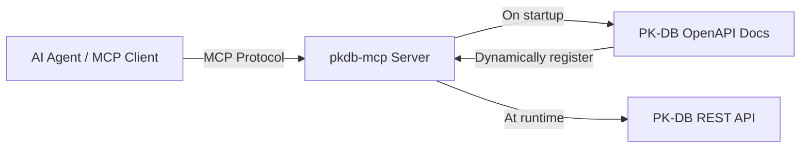

# pkdb-mcp

> [!NOTE]
> This README was translated by AI from the original [Chinese version](./README.md).

An MCP server for the [PK-DB](https://pk-db.com) REST API — serving the pharmacometrics and pharmacokinetics data platform.

[](https://python.org)
[](LICENSE)
[](https://docs.astral.sh/ruff)

<!-- README-I18N:START -->

[中文](./README.md) | **English**

<!-- README-I18N:END -->

`pkdb-mcp` connects AI agents to PK-DB via the [Model Context Protocol](https://modelcontextprotocol.io). On startup, it fetches PK-DB's live OpenAPI documentation and dynamically registers an MCP tool for each API operation — no manual interface bindings required.

---

## Features

- **Dynamic Tool Generation** — Reads PK-DB's live Swagger/OpenAPI docs and registers all operations as MCP tools with typed signatures.
- **Fallback Specification** — If the live docs are unavailable, the server falls back to a built-in spec file covering the core public API.
- **Utility Tools** — Always available for operation discovery and ad-hoc requests.
- **Swagger 2.0 & OpenAPI 3.x** — Transparently parses both formats.
- **Binary Responses** — Automatically Base64-encodes binary payloads like ZIP, PDF, XLSX.
- **Multiple Transports** — Supports `stdio`, `SSE`, and `streamable-http` MCP transports.

## What is PK-DB?

[PK-DB](https://pk-db.com) is a web-based platform for pharmacometrics data management. Pharmacometrics uses mathematical models to describe drug absorption, distribution, metabolism, and excretion in the human body. PK-DB stores pharmacokinetic/pharmacodynamic (PK/PD) study data, non-compartmental analysis (NCA) results, population PK models, and related metadata. The platform offers a [REST API](https://pk-db.com/api/v1/swagger.json) for querying studies, compounds, subjects, observations, and performing statistical analyses.

## How It Works



At runtime, the server executes the following flow:

1. Fetches the OpenAPI document from the configured URL
2. Parses each `path + method` operation into a normalized operation catalog
3. Registers an MCP tool for each operation with appropriate typed parameters
4. Forwards incoming tool calls to the PK-DB REST API
5. Returns JSON, plain text, or Base64-encoded binary responses

> [!NOTE]
> If live doc fetching fails and `PKDB_USE_FALLBACK_SPEC` is set to `true` (default), the server falls back to a built-in spec file covering the core public API. Set it to `false` to strictly require live docs.

## Requirements

- Python 3.13+
- [uv](https://docs.astral.sh/uv/)

## Installation

```bash
git clone https://github.com/lyjjl/pkdb-mcp.git
cd pkdb-mcp
uv sync --extra dev
```

## Usage

### Run as an MCP Server

```bash
uv run pkdb-mcp
```

### Configure Claude Desktop

Add to `claude_desktop_config.json`:

```json
{
  "mcpServers": {
    "pkdb": {
      "command": "uv",
      "args": ["--directory", "/absolute/path/to/pkdb-mcp", "run", "pkdb-mcp"],
      "env": {
        "PKDB_API_BASE_URL": "https://pk-db.com/api/v1",
        "PKDB_OPENAPI_URL": "https://pk-db.com/api/v1/swagger.json"
      }
    }
  }
}
```

### Configure OpenCode

Add to `opencode.jsonc`:

```jsonc
{
  "$schema": "https://opencode.ai/config.json",
  "mcp": {
    "pkdb": {
      "type": "local",
      "command": [
        "uv",
        "--directory",
        "/absolute/path/to/pkdb-mcp",
        "run",
        "pkdb-mcp",
      ],
      "enabled": true,
      "environment": {
        "PKDB_API_BASE_URL": "https://pk-db.com/api/v1",
        "PKDB_OPENAPI_URL": "https://pk-db.com/api/v1/swagger.json",
      },
    },
  },
}
```

### Configure Codex

Add to `~/.codex/config.toml`:

```toml
[mcp_servers.pkdb]
command = "uv"
args = ["--directory", "/absolute/path/to/pkdb-mcp", "run", "pkdb-mcp"]

[mcp_servers.pkdb.env]
PKDB_API_BASE_URL = "https://pk-db.com/api/v1"
PKDB_OPENAPI_URL = "https://pk-db.com/api/v1/swagger.json"
```

> [!TIP]
> Set `PKDB_API_TOKEN` in the `env` block to access authenticated write/review endpoints. Do not store tokens with write permissions in shared configuration files.

## Configuration

All configuration is through environment variables prefixed with `PKDB_`:

| Variable                    | Default                                 | Description                                                                             |
| --------------------------- | --------------------------------------- | --------------------------------------------------------------------------------------- |
| `PKDB_API_BASE_URL`         | `https://pk-db.com/api/v1`              | REST API base URL                                                                       |
| `PKDB_OPENAPI_URL`          | `https://pk-db.com/api/v1/swagger.json` | OpenAPI document URL                                                                    |
| `PKDB_API_TOKEN`            | _(not set)_                             | Optional token for authenticated endpoints                                              |
| `PKDB_USE_FALLBACK_SPEC`    | `true`                                  | Whether to fall back to built-in spec when live docs unavailable                        |
| `PKDB_MCP_TRANSPORT`        | `stdio`                                 | MCP transport (`stdio`, `sse`, or `streamable-http`)                                    |
| `PKDB_MCP_SERVER_NAME`      | `pkdb-mcp`                              | MCP server name advertised to clients                                                   |
| `PKDB_HTTP_TIMEOUT_SECONDS` | `30`                                    | HTTP request timeout in seconds                                                         |
| `PKDB_PROXY`                | _(not set)_                             | Optional HTTP/SOCKS proxy URL (e.g., `http://proxy:8080`); SOCKS requires `socks` extra |

The project includes `.env.example` as a sample environment configuration file.

## Tools

### Generated Interface Tools

Each OpenAPI operation is registered as a tool prefixed with `pkdb_`. For example, the `statistics_list` operation becomes:

```text
pkdb_statistics_list
```

Tool names are normalized to valid snake_case Python identifiers. Parameters are keyword-only with types derived from the OpenAPI document. Optional parameters default to `None`, required parameters have no default. When the upstream document omits an operation ID, the server auto-derives one from the HTTP method and path.

### Utility Tools

The following tools are always available, regardless of the loaded spec:

| Tool                      | Purpose                                                                                                      |
| ------------------------- | ------------------------------------------------------------------------------------------------------------ |
| `pkdb_list_operations`    | List all loaded operations with metadata. Supports `tag` and `search` filters.                               |
| `pkdb_describe_operation` | Show parameters, request body, and full description for a given operation.                                   |
| `pkdb_raw_request`        | Make arbitrary HTTP requests to the PK-DB API. Useful for newly added endpoints not yet in the current spec. |

### Response Format

All tools return a JSON object with the following fields:

- `status_code` — HTTP status code
- `ok` — Whether the request succeeded (2xx)
- `content_type` — Response content type
- `data` / `text` / `data_base64` — Response payload in the corresponding format

Binary responses (ZIP, PDF, XLSX, etc.) are returned Base64-encoded, along with `encoding` and `size_bytes` fields.

## Architecture

```
src/pkdb_mcp/
├── __init__.py     # Package metadata
├── __main__.py     # CLI entry point
├── server.py       # FastMCP server factory
├── openapi.py      # OpenAPI loading, parsing, and normalization
├── client.py       # HTTP client for PK-DB operations
├── registry.py     # MCP tool registration
├── settings.py     # Environment-variable-based configuration
├── errors.py       # Domain-specific exceptions
├── types.py        # JSON type aliases
└── specs/          # Built-in fallback spec
```

The project deliberately stays lean: OpenAPI parsing, HTTP execution, MCP registration, and configuration are cleanly separated, with no heavy framework dependencies beyond the MCP Python SDK, httpx, and pydantic.

## Development

```bash
# Format
uv run ruff format .

# Lint
uv run ruff check .

# Type check
uv run ty check

# Run tests
uv run pytest
```

### CI Pipeline

The project uses GitHub Actions — see [`.github/workflows/ci.yml`](.github/workflows/ci.yml). On every push and pull request, the CI pipeline runs ruff format check, ruff lint, pytest, and ty type check sequentially.
