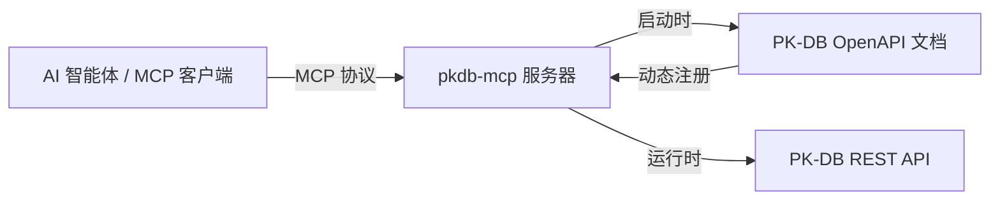

# pkdb-mcp

面向 [PK-DB](https://pk-db.com) REST API 的 MCP 服务器 —— 服务于药理学计量学与药物动力学数据平台。

[](https://python.org)
[](LICENSE)
[](https://docs.astral.sh/ruff)
[](https://pypi.org/project/pkdb-mcp/)

`pkdb-mcp` 通过[模型上下文协议](https://modelcontextprotocol.io)将 AI 智能体与 PK-DB 相连。启动时，它会拉取 PK-DB 的实时 OpenAPI 文档，并为每个 API 操作动态注册一个 MCP 工具——无需手动编写接口绑定。

---

<!-- README-I18N:START -->

**中文** | [English](./README.en.md)

<!-- README-I18N:END -->

## 功能特性

- **动态工具生成** —— 读取 PK-DB 的实时 Swagger/OpenAPI 文档，将所有操作注册为带类型签名的 MCP 工具。
- **后备规范** —— 若实时文档不可用，服务器会回退至包含核心公开接口的内置规范文件。
- **辅助工具** —— 始终可用，用于操作发现和临时请求。
- **Swagger 2.0 与 OpenAPI 3.x** —— 透明解析两种格式。
- **二进制响应** —— 自动对 ZIP、PDF、XLSX 等二进制载荷进行 Base64 编码。
- **多传输通道** —— 支持 `stdio`、`SSE` 和 `streamable-http` 三种 MCP 传输方式。

## 什么是 PK-DB？

[PK-DB](https://pk-db.com) 是一个药理学计量学数据管理网络平台。药理学计量学通过数学模型描述药物在人体内的吸收、分布、代谢和排泄过程。PK-DB 存储药代动力学/药效学（PK/PD）研究数据、非房室分析（NCA）结果、群体 PK 模型及相关元数据。该平台提供 [REST API](https://pk-db.com/api/v1/swagger.json)，用于查询研究、化合物、受试者、观测数据以及进行统计分析。

## 工作原理



运行时，服务器执行以下流程：

1. 从配置的 URL 获取 OpenAPI 文档
2. 将每个 `路径 + 方法` 的操作解析为标准化的操作目录
3. 为每个操作注册一个 MCP 工具，并附带适当的类型化参数
4. 将传入的工具调用转发至 PK-DB REST API
5. 返回 JSON、纯文本或 Base64 编码的二进制响应

> [!NOTE]
> 如果实时文档获取失败，且 `PKDB_USE_FALLBACK_SPEC` 设置为 `true`（默认值），服务器将回退至包含核心公开接口的内置规范文件。如需严格依赖实时文档，请将其设为 `false`。

## 环境要求

- Python 3.13+
- [uv](https://docs.astral.sh/uv/)

## 安装

```bash
# 推荐：直接从 PyPI 运行（无需本地安装）
uvx pkdb-mcp
```

或者从源码安装：

```bash
git clone https://github.com/lyjjl/pkdb-mcp.git
cd pkdb-mcp
uv sync --extra dev
```

## 使用方法

### 作为 MCP 服务器运行

```bash
# 直接从 PyPI 运行（推荐）
uvx pkdb-mcp

# 或从本地源码目录运行
uv run pkdb-mcp
```

### 配置 Claude Desktop

在 `claude_desktop_config.json` 中添加：

```json
{
  "mcpServers": {
    "pkdb": {
      "command": "uvx",
      "args": ["pkdb-mcp"],
      "env": {
        "PKDB_API_BASE_URL": "https://pk-db.com/api/v1",
        "PKDB_OPENAPI_URL": "https://pk-db.com/api/v1/swagger.json"
      }
    }
  }
}
```

如果使用本地克隆的源码目录：

```json
{
  "mcpServers": {
    "pkdb": {
      "command": "uv",
      "args": ["--directory", "/absolute/path/to/pkdb-mcp", "run", "pkdb-mcp"],
      "env": {
        "PKDB_API_BASE_URL": "https://pk-db.com/api/v1",
        "PKDB_OPENAPI_URL": "https://pk-db.com/api/v1/swagger.json"
      }
    }
  }
}
```

### 配置 OpenCode

在 `opencode.jsonc` 中添加：

```jsonc
{
  "$schema": "https://opencode.ai/config.json",
  "mcp": {
    "pkdb": {
      "type": "local",
      "command": ["uvx", "pkdb-mcp"],
      "enabled": true,
      "environment": {
        "PKDB_API_BASE_URL": "https://pk-db.com/api/v1",
        "PKDB_OPENAPI_URL": "https://pk-db.com/api/v1/swagger.json",
      },
    },
  },
}
```

如果使用本地克隆的源码目录：

```jsonc
{
  "$schema": "https://opencode.ai/config.json",
  "mcp": {
    "pkdb": {
      "type": "local",
      "command": [
        "uv",
        "--directory",
        "/absolute/path/to/pkdb-mcp",
        "run",
        "pkdb-mcp",
      ],
      "enabled": true,
      "environment": {
        "PKDB_API_BASE_URL": "https://pk-db.com/api/v1",
        "PKDB_OPENAPI_URL": "https://pk-db.com/api/v1/swagger.json",
      },
    },
  },
}
```

### 配置 Codex

在 `~/.codex/config.toml` 中添加：

```toml
[mcp_servers.pkdb]
command = "uvx"
args = ["pkdb-mcp"]

[mcp_servers.pkdb.env]
PKDB_API_BASE_URL = "https://pk-db.com/api/v1"
PKDB_OPENAPI_URL = "https://pk-db.com/api/v1/swagger.json"
```

如果使用本地克隆的源码目录：

```toml
[mcp_servers.pkdb]
command = "uv"
args = ["--directory", "/absolute/path/to/pkdb-mcp", "run", "pkdb-mcp"]

[mcp_servers.pkdb.env]
PKDB_API_BASE_URL = "https://pk-db.com/api/v1"
PKDB_OPENAPI_URL = "https://pk-db.com/api/v1/swagger.json"
```

> [!TIP]
> 在 `env` 块中设置 `PKDB_API_TOKEN` 以访问需要身份认证的写入/审核接口。请勿将具备写入权限的令牌存放在共享配置文件中。

## 配置

所有配置项均为环境变量，以 `PKDB_` 为前缀：

| 变量                        | 默认值                                  | 描述                                                                            |
| --------------------------- | --------------------------------------- | ------------------------------------------------------------------------------- |
| `PKDB_API_BASE_URL`         | `https://pk-db.com/api/v1`              | REST API 基础 URL                                                               |
| `PKDB_OPENAPI_URL`          | `https://pk-db.com/api/v1/swagger.json` | OpenAPI 文档 URL                                                                |
| `PKDB_API_TOKEN`            | _(未设置)_                              | 可选，用于认证端点的令牌                                                        |
| `PKDB_USE_FALLBACK_SPEC`    | `true`                                  | 实时文档不可用时是否回退至内置规范                                              |
| `PKDB_MCP_TRANSPORT`        | `stdio`                                 | MCP 传输方式（`stdio`、`sse` 或 `streamable-http`）                             |
| `PKDB_MCP_SERVER_NAME`      | `pkdb-mcp`                              | 向客户端宣告的 MCP 服务器名称                                                   |
| `PKDB_HTTP_TIMEOUT_SECONDS` | `30`                                    | HTTP 请求超时时间（秒）                                                         |
| `PKDB_PROXY`                | _(未设置)_                              | 可选的 HTTP/SOCKS 代理 URL（如 `http://proxy:8080`）；SOCKS 需 `socks` 额外依赖 |

项目附带 `.env.example` 作为示例环境配置文件。

## 工具

### 生成的接口工具

每个 OpenAPI 操作均以 `pkdb_` 为前缀注册为一个工具。例如，`statistics_list` 操作会生成为：

```text
pkdb_statistics_list
```

工具名称会被规范化为合法的蛇形命名 Python 标识符。参数为仅关键字参数，类型派生自 OpenAPI 文档。可选参数默认值为 `None`，必选参数无默认值。当上游文档未提供操作 ID 时，服务器会根据 HTTP 方法和路径自动派生。

### 辅助工具

无论加载何种规范，以下工具始终可用：

| 工具                      | 用途                                                                      |
| ------------------------- | ------------------------------------------------------------------------- |
| `pkdb_list_operations`    | 列出所有已加载的操作及其元数据。支持 `tag` 和 `search` 过滤器。           |
| `pkdb_describe_operation` | 展示指定操作的参数、请求体及完整描述。                                    |
| `pkdb_raw_request`        | 对 PK-DB API 执行任意 HTTP 请求。适用于已添加但尚未纳入当前文档的新接口。 |

### 响应格式

所有工具均返回一个 JSON 对象，包含以下字段：

- `status_code` —— HTTP 状态码
- `ok` —— 请求是否成功（2xx）
- `content_type` —— 响应内容类型
- `data` / `text` / `data_base64` —— 相应格式的响应载荷

二进制响应（ZIP、PDF、XLSX 等）以 Base64 编码返回，并附有 `encoding` 字段和 `size_bytes` 字段。

## 架构

```
src/pkdb_mcp/
├── __init__.py     # 包元数据
├── __main__.py     # 命令行入口
├── server.py       # FastMCP 服务器工厂
├── openapi.py      # OpenAPI 加载、解析与规范化
├── client.py       # PK-DB 操作的 HTTP 客户端
├── registry.py     # MCP 工具注册
├── settings.py     # 基于环境变量的配置
├── errors.py       # 领域特定异常
├── types.py        # JSON 类型别名
└── specs/          # 内置后备规范
```

项目有意保持精简：OpenAPI 解析、HTTP 执行、MCP 注册和配置之间职责分明，除 MCP Python SDK、httpx 和 pydantic 外不依赖任何重型框架。

## 开发

```bash
# 格式化
uv run ruff format .

# 代码检查
uv run ruff check .

# 类型检查
uv run ty check

# 运行测试
uv run pytest
```

### 流水线

项目使用 GitHub Actions —— 详见 [`.github/workflows/ci.yml`](.github/workflows/ci.yml)。每次推送和拉取请求时，CI 流水线会依次运行 ruff 格式检查、ruff 代码检查、pytest 测试和 ty 类型检查。
